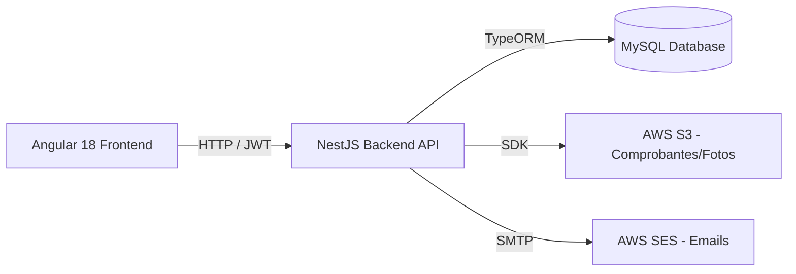

# Documento de Diseño del Sistema - Plataforma de Reservas Sindicato ENAP

Este documento describe la arquitectura de software, los modelos de datos, las reglas de negocio y la estrategia de transición desde el prototipo actual (Mock Frontend) hacia el sistema de producción final.

---

## 1. Arquitectura de la Solución

El sistema se basa en una arquitectura cliente-servidor desacoplada:

### Frontend (Prototipo Actual - en `/frontend`)
*   **Diseño Modular:** Dividido en capas (`core` para servicios/lógica de negocio global y `features` para las vistas).
*   **Manejo de Estado Reactivo:** Implementado mediante **Angular Signals** en los servicios del core para manejar de forma reactiva el estado del usuario activo (`AuthService`) y la lista de reservas (`BookingsService`).
*   **Persistencia Temporal:** El usuario autenticado de prueba se almacena en el `sessionStorage` del navegador para mantener la sesión activa al recargar la página.

### Backend (Fase 1 - Mock en Memoria en `/backend`)
*   **Framework:** NestJS 11 + TypeScript con controladores específicos para cada recurso (`health`, `auth`, `spaces`, `bookings`, `announcements`).
*   **Manejo de Estado:** Almacenado en memoria mediante variables locales en los servicios correspondientes (`bookings.service.ts`, `spaces.service.ts`, etc.) para simular una base de datos relacional activa.
*   **Autenticación y Seguridad:** Simulado a través de tokens en Base64 enviados en la cabecera `Authorization: Bearer <token>`. El backend decodifica el token para extraer el identificador y rol del usuario, validando sus permisos correspondientes.

### Backend (Siguiente Fase de Producción)
*   **Acceso a Datos:** **TypeORM** como ORM para definir los esquemas de bases de datos utilizando clases de TypeScript y manejar migraciones de forma automática.
*   **Motor de Base de Datos:** **MySQL** relacional para garantizar consistencia e integridad referencial.

---

## 2. Modelos de Datos (Entidades de Dominio)

Los modelos están definidos en [models.ts (Frontend)](file:///home/daniel/projects/enap-mock-frontend/frontend/src/app/core/models.ts) y en [models.ts (Backend)](file:///home/daniel/projects/enap-mock-frontend/backend/src/models.ts). La estructura se compone de las siguientes entidades:

### Usuario (`User`)
*   `id` (number): Identificador único.
*   `full_name` (string): Nombre completo.
*   `rut` (string): RUT chileno para validación de identidad.
*   `email` (string): Correo electrónico.
*   `role` (`UserRole`): Roles del sistema (`socio`, `external`, `admin`).
*   `ficha_number` (string, opcional): Número de ficha sindical (solo para socios).

### Espacio (`Space`)
*   `id` (number): Identificador único.
*   `name` (string): Nombre comercial del espacio.
*   `type` (`SpaceType`): Clasificación del espacio (`cabin` | `quincho` | `pool`).
*   `description` (string): Descripción detallada.
*   `max_capacity` (number): Límite máximo de personas permitidas.
*   `base_price` (number): Tarifa por día para usuarios externos.
*   `socio_price` (number): Tarifa por día preferencial para socios del sindicato.
*   `guest_price` (number): Costo diario por invitado adicional.
*   `free_guests_for_socio` (number): Cantidad de invitados libres de cobro permitidos para socios.
*   `images` (string[]): Rutas/URLs de fotos del recinto.
*   `amenities` (string[]): Lista de comodidades.

### Invitado (`Guest`)
*   `id` (number, opcional): ID autoincremental del invitado.
*   `full_name` (string): Nombre del invitado.
*   `rut` (string): RUT de control de acceso.
*   `phone` (string, opcional): Teléfono de contacto.

### Reserva (`Booking`)
*   `id` (number): Identificador único.
*   `booking_code` (string): Código de reserva autogenerado legible (ej: `ENP-2025-00004`).
*   `user` (`User`): Usuario titular de la reserva.
*   `space` (`Space`): Espacio reservado.
*   `check_in` (string): Fecha de entrada (`YYYY-MM-DD`).
*   `check_out` (string): Fecha de salida (`YYYY-MM-DD`).
*   `status` (`BookingStatus`): Estados del ciclo de vida de la reserva (`pending_payment`, `pending_approval`, `confirmed`, `cancelled`, `rejected`, `expired`).
*   `total_amount` (number): Monto final calculado a pagar.
*   `guests` (`Guest`[]): Lista de personas invitadas.
*   `receipt_url` (string, opcional): Enlace al comprobante de transferencia bancaria subido.
*   `admin_notes` (string, opcional): Comentarios o motivos de rechazo del administrador.
*   `created_at` (string): Fecha y hora de creación.
*   `price_breakdown` (`PriceBreakdown`): Detalle pormenorizado del cobro final.
*   `is_for_third_party` (boolean): Flag indicando si la reserva es para un tercero externo patrocinado por el socio.
*   `third_party_name` (string, opcional): Nombre completo del tercero ocupante.
*   `third_party_rut` (string, opcional): RUT del tercero ocupante.
*   `third_party_phone` (string, opcional): Teléfono de contacto del tercero.
*   `admin_created_for_external` (boolean): Flag indicando si la reserva fue ingresada por administración para un externo.

---

## 3. Reglas de Negocio Clave (Implementadas en NestJS)

### 3.1 Cálculo de Tarifas (`calculatePriceBreakdown`)
El backend NestJS calcula dinámicamente el precio final en [bookings.service.ts](file:///home/daniel/projects/enap-mock-frontend/backend/src/bookings/bookings.service.ts):
1.  **Días de Reserva:** Determina la diferencia de días entre `check_in` y `check_out` (mínimo 1 día). Para arriendos de jornada única, la diferencia es de 1 día.
2.  **Costo Base del Espacio:**
    *   Si el titular es `socio` y realiza la reserva para sí mismo (`is_for_third_party = false`), aplica la tarifa con descuento `socio_price`.
    *   Si el titular es `socio` pero reserva para un tercero (`is_for_third_party = true`), la tarifa preferencial se descarta y aplica la tarifa base `base_price` (Público General/Externo).
    *   Si el titular es `external`, aplica `base_price`.
    *   El costo total base es el precio diario unitario por la cantidad de días.
3.  **Cobro por Acompañantes:**
    *   Si aplica tarifa de socio (`socio` y `is_for_third_party = false`), tiene derecho a un cupo gratuito de acompañantes definido por `free_guests_for_socio` (ej. 5 invitados en piscina). Cualquier invitado adicional que supere este límite se cobra diariamente al costo de `guest_price`.
    *   Si es reserva para un tercero o el titular es `external`, no hay cupos gratuitos; se cobra `guest_price` para cada invitado del listado.

> [!NOTE]
> **Aclaración sobre la Fórmula de Tarifas del Manual del Cliente:**
> El manual de usuario del cliente presenta el siguiente ejemplo de cálculo para un Socio:
> `total = (TarifaEspacio * dias) + (cantidadInvitados * 3500) + ((InvitadosPiscina - 5) * 3500)`
> Con el ejemplo numérico: `(10,000 * 6) + (6 * 3,500) + ((6 - 5) * 3,500) = $84,500`.
>
> **Interpretación en la Plataforma:**
> En el sistema, las reservas se gestionan de forma individual por recinto (Cabaña, Quincho o Piscina). Por lo tanto, el ejemplo del manual representa la **suma de dos reservas independientes realizadas por el Socio**:
> 1. **Reserva de Cabaña** (ej. $10,000 tarifa socio por 6 días, con 6 invitados): `(10,000 * 6) + (6 * 3,500) = $81,000`.
> 2. **Reserva de Piscina General** (tarifa socio $0, para 6 invitados con beneficio de 5 gratis): `(0 * 1) + ((6 - 5) * 3,500) = $3,500`.
>
> El total combinado de ambas reservas es `$81,000 + $3,500 = $84,500`, lo cual coincide plenamente con la lógica de cálculo unitario del sistema.

### 3.2 Validación de Bloqueos de Disponibilidad
Antes de registrar cualquier reserva, el backend valida si las fechas están libres:
1.  **Bloqueos Estáticos:** Compara las fechas solicitadas contra el diccionario `blockedDates` cargado con fechas fuera de servicio programadas.
2.  **Solapamiento de Reservas:** Verifica que no exista ninguna reserva activa (en estado `confirmed` o `pending_approval`) en el mismo recinto que coincida con las fechas solicitadas.
    *   **Arriendo por Jornada Única (Quinchos/Piscina):** Al igualarse check-in y check-out (`check_in === check_out`), la colisión de fechas se valida comparando exactamente el mismo día de manera inclusiva, garantizando que no se puedan agendar dos reservas el mismo día para el mismo espacio.
3.  **Límite de Capacidad:** Valida que el número de personas en `guests` no exceda el `max_capacity` del recinto (limitado a un máximo de 6 personas en cabañas).

### 3.3 Encriptación de Contraseñas (PBKDF2)
Para resguardar las credenciales en esta fase de mock y de cara a producción, implementamos un esquema de derivación de claves criptográficas PBKDF2:
*   **Salting:** Cada contraseña se encripta de forma exclusiva generando una semilla aleatoria (salt) de 16 bytes.
*   **Derivación:** Se ejecutan 1000 iteraciones utilizando la función hash SHA-512.
*   **Almacenamiento:** El password final se guarda en formato `<salt>:<hash>` en el campo `passwordHash` para ser verificado en futuros inicios de sesión sin almacenar la clave en texto plano.

---

## 4. Endpoints Habilitados en la API

La API del backend expone los siguientes endpoints (escuchando por defecto en el puerto `3000`):

*   `GET /health`: Estado utilitario de salud del servicio.
*   `POST /auth/login`: Validación de credenciales y contraseña; entrega el token Base64 y la información del usuario.
*   `POST /auth/register`: Registro de un nuevo usuario en la plataforma (retorna el perfil y token correspondientes).
*   `GET /users`: (Admin) Obtención de la lista de todos los usuarios registrados.
*   `POST /users`: (Admin) Registro de un nuevo usuario.
*   `PATCH /users/:id/toggle-status`: (Admin) Activar o desactivar a un usuario/socio sindical.
*   `GET /users/profile`: Obtención del perfil del usuario autenticado actual.
*   `GET /spaces`: Obtención de todos los espacios reservables y sus tarifas.
*   `GET /spaces/:id`: Obtención de los detalles de un espacio reservable específico.
*   `POST /spaces`: (Admin) Creación de un nuevo espacio.
*   `PUT /spaces/:id`: (Admin) Edición y actualización de las propiedades de un espacio.
*   `DELETE /spaces/:id`: (Admin) Eliminación de un espacio.
*   `GET /announcements`: Lista de comunicados informativos publicados.
*   `GET /bookings`: (Admin) Listado de todas las reservas del sistema.
*   `GET /bookings/me`: Historial de reservas asociadas al usuario autenticado actual.
*   `GET /bookings/blocked-dates/:spaceId`: Consulta pública de fechas bloqueadas y reservadas para un espacio.
*   `POST /bookings`: Creación de una reserva (ejecuta validaciones de capacidad y disponibilidad de fechas).
*   `POST /bookings/upload-receipt`: Simula la recepción de un comprobante de transferencia y lo asocia a la reserva en estado `pending_approval`.
*   `PATCH /bookings/:id/approve`: (Admin) Aprobación administrativa (pasa a `confirmed`).
*   `PATCH /bookings/:id/reject`: (Admin) Rechazo administrativa (pasa a `rejected` y adjunta comentarios del administrador).

---

## 5. Próxima Etapa de Integración en el Frontend

Para comunicar la aplicación de Angular con la API de NestJS:
1.  **Actualizar Entorno:** Definir la propiedad `apiUrl: 'http://localhost:3000'` en los archivos `environment.ts` de Angular.
2.  **Interceptor JWT:** Crear un interceptor de Angular que intercepte todas las llamadas HTTP salientes y adjunte la cabecera `Authorization: Bearer <token>` cuando el token esté disponible.
3.  **Actualizar Clientes HTTP:** Reemplazar los retornos mock en memoria (`of(MOCK_...)`) en los servicios del frontend (`AuthService`, `BookingsService`, `SpacesService`, `AnnouncementsService`) por peticiones REST reales utilizando `HttpClient`.

---

## 6. Consideraciones de Carga de Archivos en AWS

Al planificar la arquitectura de producción y el despliegue del sistema en AWS (ej. serverless o proxies), se deben tener en cuenta las siguientes limitaciones de tamaño para las peticiones de subida de archivos (comprobantes de pago y fotos de recintos):

### Limitaciones de Payload por Arquitectura
- **API Gateway (HTTP/REST Proxy únicamente):** Límite máximo de payload de **10 MB**.
- **API Gateway + AWS Lambda Proxy:** Límite máximo de payload de **6 MB** (restricción estricta de invocación síncrona en AWS Lambda).
- **Archivos Codificados en Base64:** Al convertir archivos binarios a texto Base64, el tamaño del payload aumenta aproximadamente un **33%**. Esto reduce el tamaño real máximo de los archivos que se pueden subir de forma segura a **~7.5 MB** (usando API Gateway directo) y a **~4.5 MB** (usando Lambda Proxy).

> [!TIP]
> Para evitar estas limitaciones y el consumo excesivo de memoria del servidor, una arquitectura óptima a futuro contempla el uso de **URLs Presirmadas (Presigned URLs)** de S3. El backend genera la URL autorizada y el cliente sube el archivo directamente al bucket de S3 sin sobrecargar la API.
