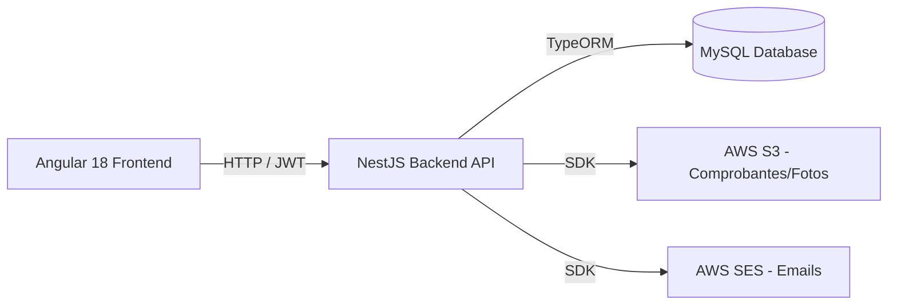
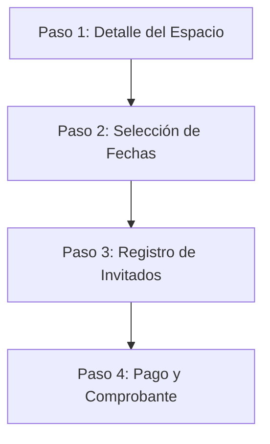

# Documento de Diseño del Sistema - Plataforma de Reservas Sindicato ENAP

Este documento describe la arquitectura de software, los modelos de datos, las reglas de negocio y la estrategia de transición desde el prototipo actual (Mock Frontend) hacia el sistema de producción final.

---

## 1. Arquitectura de la Solución

El sistema se basa en una arquitectura cliente-servidor desacoplada:



### Frontend (Prototipo Actual - en `/frontend`)
*   **Diseño Modular:** Dividido en capas (`core` para servicios/lógica de negocio global y `features` para las vistas).
*   **Manejo de Estado Reactivo:** Implementado mediante **Angular Signals** en los servicios del core para manejar de forma reactiva el estado del usuario activo (`AuthService`) y la lista de reservas (`BookingsService`).
*   **Persistencia Temporal:** El usuario autenticado de prueba se almacena en el `sessionStorage` del navegador para mantener la sesión activa al recargar la página.

### Backend (Próxima Iteración - en `/backend`)
*   **Estructura:** Framework modular **NestJS** estructurado por recursos (auth, users, spaces, bookings, payments).
*   **Acceso a Datos:** **TypeORM** como ORM para definir los esquemas de bases de datos utilizando clases de TypeScript y manejar migraciones de forma automática.
*   **Motor de Base de Datos:** **MySQL** relacional para garantizar consistencia e integridad referencial.

---

## 2. Modelos de Datos (Entidades de Dominio)

Definidos en [models.ts](file:///home/daniel/projects/enap-mock-frontend/frontend/src/app/core/models.ts). La estructura se compone de las siguientes entidades:

### Usuario (`User`)
Representa a cualquier persona con acceso al sistema.
*   `id` (number): Identificador único.
*   `full_name` (string): Nombre completo.
*   `rut` (string): RUT chileno para validación de identidad.
*   `email` (string): Correo electrónico.
*   `role` (`UserRole`): Roles del sistema:
    *   `socio`: Miembro del Sindicato ENAP (goza de tarifas rebajadas).
    *   `external`: Público general (paga tarifa base).
    *   `admin`: Administrador de la plataforma.
*   `ficha_number` (string, opcional): Número de ficha sindical (solo requerido para socios).

### Espacio (`Space`)
Representa los recintos reservables (cabañas, quinchos, piscinas) en el centro vacacional.
*   `id` (number): Identificador único.
*   `name` (string): Nombre comercial del espacio (ej: "Cabaña Los Boldos").
*   `type` (`SpaceType`): Clasificación del espacio (`cabin` | `quincho` | `pool`).
*   `description` (string): Descripción detallada del equipamiento y entorno.
*   `max_capacity` (number): Límite máximo de personas permitidas simultáneamente.
*   `base_price` (number): Tarifa por día para usuarios externos.
*   `socio_price` (number): Tarifa por día preferencial para socios del sindicato.
*   `guest_price` (number): Costo diario por invitado adicional.
*   `free_guests_for_socio` (number): Cantidad de invitados libres de cobro permitidos para socios (ej: pase de piscina).
*   `images` (string[]): Rutas/URLs de fotos del recinto.
*   `amenities` (string[]): Lista de comodidades (calefacción, parrilla, TV, etc.).

### Invitado (`Guest`)
Persona registrada por el titular de la reserva para asistir al recinto.
*   `id` (number, opcional): ID autoincremental.
*   `full_name` (string): Nombre del invitado.
*   `rut` (string): RUT del invitado para el control de acceso.
*   `phone` (string, opcional): Teléfono de contacto.

### Reserva (`Booking`)
La transacción y registro de ocupación de un espacio.
*   `id` (number): Identificador único.
*   `booking_code` (string): Código de reserva autogenerado y legible (ej: `ENP-2025-00004`).
*   `user` (`User`): Usuario titular que realiza la reserva.
*   `space` (`Space`): Espacio reservado.
*   `check_in` (string): Fecha de entrada (formato `YYYY-MM-DD`).
*   `check_out` (string): Fecha de salida (formato `YYYY-MM-DD`).
*   `status` (`BookingStatus`): Estados del ciclo de vida de la reserva:
    *   `pending_payment`: Creada pero en espera de subir el comprobante de transferencia bancaria.
    *   `pending_approval`: Comprobante subido, esperando revisión administrativa.
    *   `confirmed`: Comprobante aprobado por administración; espacio asegurado.
    *   `cancelled`: Cancelada por el usuario.
    *   `rejected`: Comprobante rechazado por administración o reserva inválida.
    *   `expired`: Venció el plazo de pago sin subir el comprobante.
*   `total_amount` (number): Monto final calculado a pagar.
*   `guests` (`Guest`[]): Lista de personas invitadas que asistirán.
*   `receipt_url` (string, opcional): Enlace al comprobante de transferencia bancaria subido.
*   `admin_notes` (string, opcional): Comentarios o motivos de rechazo ingresados por el administrador.
*   `created_at` (string): Fecha y hora de creación de la reserva.
*   `price_breakdown` (`PriceBreakdown`): Detalle pormenorizado del cobro final.

### Desglose de Precio (`PriceBreakdown`)
*   `base` (number): Costo del arriendo del espacio (precio unitario × cantidad de días).
*   `days` (number): Cantidad de días de reserva.
*   `guests_count` (number): Número total de invitados.
*   `guests_total` (number): Costo cobrado por invitados adicionales.
*   `free_guests_applied` (number): Número de invitados que ingresan de forma gratuita (descontados del total).
*   `discount` (number): Descuento total aplicado por cupos gratuitos.
*   `total` (number): Suma neta final (`base + guests_total`).

---

## 3. Reglas de Negocio Clave

### 3.1 Lógica de Cálculo de Precios (`calculatePrice`)
La tarifa de una reserva se calcula dinámicamente en el método `calculatePrice` del servicio [bookings.service.ts](file:///home/daniel/projects/enap-mock-frontend/frontend/src/app/core/services/bookings.service.ts#L26-L44):
1.  **Precio Base del Recinto:** Se multiplica por los días transcurridos. Si el check-in y check-out coinciden (mismo día), se considera como 1 día completo.
2.  **Diferenciación por Rol:**
    *   Si el usuario logueado tiene el rol `socio`, el costo diario es `socio_price` (por ejemplo, para la piscina, es `$0`).
    *   Si el rol es `external` (o no está logueado), el costo diario es `base_price`.
3.  **Cálculo de Invitados:**
    *   Si el espacio otorga invitados gratuitos al socio (ej: `free_guests_for_socio` = 5 en piscina), los primeros 5 invitados ingresados no pagan.
    *   Cualquier invitado adicional por sobre el límite gratuito se cobra a precio de invitado (`guest_price`).
    *   Para usuarios externos, no se aplican invitados gratuitos; todos los invitados sumados pagan `guest_price`.

### 3.2 Bloqueo de Fechas (`BLOCKED_DATES`)
Para prevenir reservas duplicadas o solapamiento de fechas, el sistema consulta un diccionario indexado por el ID del espacio.
*   Al seleccionar fechas, se verifica que ningún día intermedio pertenezca a la lista de días bloqueados del recinto.
*   En el backend NestJS, esto se validará mediante una consulta SQL en la base de datos que busque registros en estado `confirmed` o `pending_approval` cuyas fechas de check-in/check-out se crucen con el rango solicitado.

---

## 4. Flujo del Proceso de Reserva (Booking Flow)

El flujo de reservas está estructurado en 4 pasos interactivos en el frontend:



1.  **Paso 1: Visualización del Recinto:** Muestra fotos, descripción detallada, comodidades y las tarifas correspondientes según el rol del usuario logueado.
2.  **Paso 2: Fechas de Reserva:** El usuario selecciona el rango de fechas. El componente inhabilita automáticamente las fechas ya bloqueadas e indica cuántas noches se reservarán.
3.  **Paso 3: Invitados:** El usuario añade los nombres, RUTs y teléfonos de los acompañantes. El sistema valida dinámicamente que el número de invitados no supere el `max_capacity` del recinto.
4.  **Paso 4: Pago y Confirmación:** Se presenta un desglose claro del precio. Se muestran los datos bancarios para realizar la transferencia electrónica y un campo de entrada para subir el comprobante de transferencia bancaria (Fase 1). Al confirmar, la reserva pasa a estado `pending_approval`.

---

## 5. Estrategia de Migración al Backend NestJS

Para integrar el backend NestJS en la siguiente iteración, se deben realizar las siguientes tareas de adaptación en el Frontend:

### 5.1 Reemplazo de Servicios de Mock a API REST
Se modificará la capa de servicios en `frontend/src/app/core/services/` para utilizar el cliente HTTP de Angular (`HttpClient`):

```typescript
// Ejemplo de migración en spaces.service.ts
@Injectable({ providedIn: 'root' })
export class SpacesService {
  private apiUrl = 'https://api.sindicatoenap.cl/spaces';

  constructor(private http: HttpClient) {}

  getAll(): Observable<Space[]> {
    return this.http.get<Space[]>(this.apiUrl);
  }
}
```

### 5.2 Implementación de Interceptor JWT
Para gestionar la seguridad en las peticiones HTTP:
1.  El `AuthService` guardará el token JWT en el `localStorage` tras un inicio de sesión exitoso.
2.  Se creará un `jwt.interceptor.ts` que inyecte automáticamente la cabecera `Authorization: Bearer <token>` en cada solicitud saliente hacia el backend.

### 5.3 Carga de Comprobantes a AWS S3
En lugar de emular la subida del comprobante, el frontend realizará un envío multipart a un endpoint específico:
1.  El usuario selecciona un archivo PDF o imagen en el Paso 4.
2.  El frontend realiza una petición `POST /bookings/upload-receipt` enviando un objeto `FormData`.
3.  El backend NestJS procesará la imagen, la subirá a **AWS S3** usando el SDK de AWS, y retornará una URL pública segura, que el frontend asignará al campo `receipt_url` de la reserva.
