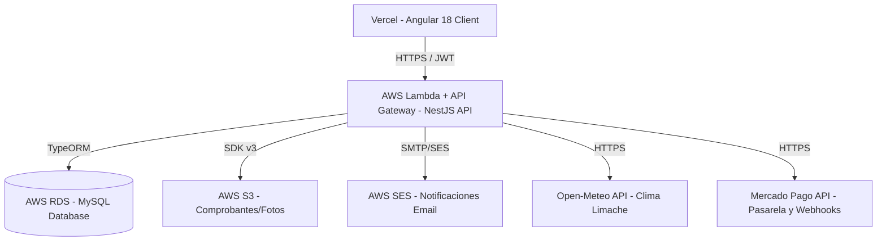

# Documento de Diseño del Sistema - Plataforma de Reservas Sindicato ENAP

Este documento describe la arquitectura de software final, los modelos de datos físicos, las reglas de negocio críticas, la seguridad y el esquema de despliegue en producción de la Plataforma de Reservas del Centro Vacacional ENAP (Limache, Chile).

---

## 1. Arquitectura de la Solución (Producción)

La plataforma está diseñada como una aplicación web desacoplada (Decoupled Single Page Application):

### Frontend (Cliente - `/frontend`)
*   **Framework:** Angular 18 con Standalone Components.
*   **Estado Reactivo:** Uso de **Angular Signals** en servicios centrales para mantener reactividad en autenticación, reservas y estado del clima.
*   **Estilos:** Vanilla CSS con Tailwind CSS para una interfaz responsive, moderna y premium.
*   **Componentes Compartidos:** Header/Navbar global y un Footer institucional unificado (`FooterComponent`) presente en todas las páginas públicas del cliente (Inicio, Catálogo de Espacios, Paso de Reserva, Perfil de Usuario, Mis Reservas y Login) y excluido del panel administrativo.

### Backend (API Servidor - `/backend`)
*   **Framework:** NestJS 11 con controladores modulares por dominio.
*   **Acceso a Datos:** TypeORM como ORM relacional manejando esquemas de datos físicos.
*   **Motor de Base de Datos:** MySQL hospedado en **AWS RDS**.
*   **Infraestructura Serverless:** Desplegado en **AWS Lambda** detrás de **API Gateway** mediante Serverless Framework, garantizando escalabilidad automática y bajo costo.

---

## 2. Modelos de Datos (Entidades Físicas MySQL)

El backend define y persiste las siguientes tablas:

### Usuario (`UserEntity`)
*   `id` (int, PK autoincremental): Identificador único.
*   `fullName` (varchar): Nombre completo.
*   `rut` (varchar, unique): RUT chileno para validación.
*   `email` (varchar, unique): Correo electrónico.
*   `role` (enum: `'socio' | 'external' | 'admin'`): Perfil de usuario.
*   `fichaNumber` (varchar, nullable): Código de ficha sindical. Se genera automáticamente como `ENP-XXXX` si se registra un socio en la administración sin un código manual.
*   `isActive` (boolean, default true): Estado de cuenta.
*   `passwordHash` (varchar): Hash criptográfico de contraseña.
*   `phone` (varchar, nullable): Teléfono de contacto (validado bajo formato Chile).

### Espacio (`SpaceEntity`)
*   `id` (int, PK): Identificador único.
*   `name` (varchar): Nombre de la categoría (ej: "Cabañas Familiares").
*   `type` (varchar): Tipo de recinto (`cabin` | `quincho` | `pool`).
*   `description` (text): Reseña descriptiva.
*   `maxCapacity` (int): Aforo máximo de personas por unidad.
*   `basePrice` (int): Tarifa diaria para público externo.
*   `socioPrice` (int): Tarifa diaria preferencial para socios.
*   `guestPrice` (int): Costo adicional por invitado excedente.
*   `freeGuestsForSocio` (int): Número de invitados gratis diarios permitidos para socios.
*   `images` (simple-json): Array de URLs de fotos almacenadas en AWS S3.
*   `amenities` (simple-json): Comodidades disponibles.
*   `totalUnits` (int, default 1): Número de unidades físicas disponibles en esta categoría (ej: 6 para Cabañas, 10 para Quinchos).

### Reserva (`Booking`)
*   `id` (int, PK): Identificador único.
*   `bookingCode` (varchar, unique): Código legible (ej. `ENP-2025-00004`).
*   `checkIn` (varchar): Fecha de entrada (`YYYY-MM-DD`).
*   `checkOut` (varchar): Fecha de salida (`YYYY-MM-DD`).
*   `status` (varchar): Estados (`pending_payment`, `pending_approval`, `confirmed`, `cancelled`, `rejected`, `expired`).
*   `totalAmount` (int): Total calculado.
*   `receiptUrl` (varchar, nullable): URL de imagen del comprobante de transferencia en S3.
*   `adminNotes` (text, nullable): Causa del rechazo de reserva o notas de cobro.
*   `priceBreakdown` (simple-json): Desglose financiero.
*   `isForThirdParty` (boolean): Flag de patrocinio de socio a tercero.
*   `thirdPartyName` / `thirdPartyRut` / `thirdPartyPhone` (nullable): Datos del ocupante externo.
*   `adminCreatedForExternal` (boolean): Flag de reserva creada por admin.
*   `termsAccepted` (boolean, default true): Registro de aceptación de los términos del recinto.
*   `visitType` (varchar, nullable): Declaración del tipo de visita (`personal`, `family`, `friends`).
*   `assignedUnit` (varchar, nullable): Nombre o número específico asignado a la reserva (ej: `"Cabaña 3"`, `"Quincho 5"`).

### Invitado (`GuestEntity`)
*   `id` (int, PK): Identificador de invitado.
*   `fullName` (varchar): Nombre del acompañante.
*   `rut` (varchar): RUT.
*   `phone` (varchar, nullable): Teléfono.
*   `age` (int, nullable): Edad del invitado para el registro dinámico.
*   `booking` (ManyToOne -> Booking): Vínculo de reserva.

### Preguntas Frecuentes (`FaqEntity`)
*   `id` (int, PK): Identificador único.
*   `question` (varchar): Pregunta de soporte.
*   `answer` (text): Respuesta explicativa.
*   `order` (int): Prioridad de ordenamiento en el acordeón del frontend.

### Opiniones / Feedback (`FeedbackEntity`)
*   `id` (int, PK): Identificador único.
*   `rating` (int): Calificación de 1 a 5 estrellas.
*   `comment` (text): Comentarios sobre la estadía.
*   `status` (varchar, default `'pending_approval'`): Moderación (`pending_approval`, `approved`, `rejected`).
*   `createdAt` (datetime): Registro temporal.
*   `booking` (OneToOne -> Booking): Reserva que califica.
*   `user` (ManyToOne -> UserEntity): Autor.
*   `space` (ManyToOne -> SpaceEntity): Espacio evaluado.

---

## 3. Reglas de Negocio Clave

### 3.1 Validaciones de Contacto y Formato de Teléfono
Para guardar datos en el perfil o en el registro de reservas, se exige y valida telefónicamente el formato de Chile mediante la expresión regular `^(\+56)?9\d{8}$` (ej: `+56912345678` o `912345678`), limpiando espacios en blanco de forma automática antes de procesar.

### 3.2 Integración Meteorológica (Open-Meteo & Alertas Dinámicas)
*   **Servicio centralizado (`WeatherService`):** Consume en tiempo real el clima de Limache, Chile (`latitud=-33.0153`, `longitud=-71.2675`) mediante la API pública de **Open-Meteo** (con fallback a un set de datos mockeados locales en caso de caída).
*   **Uso Utilitario:**
    *   *Catálogo (`/espacios`)*: Muestra un pill con la temperatura actual en Limache.
    *   *Flujo de Reserva (Paso 1)*: Carga el pronóstico de los siguientes 3 días.
    *   *Alerta de Clima por Fecha*: Si el usuario selecciona una fecha que cae dentro del rango de pronóstico y es un espacio exterior (Piscina o Quincho) con previsión de lluvia o tormenta, el frontend gatilla dinámicamente un banner ámbar recomendando evaluar la reprogramación.

### 3.3 Gestión de Múltiples Imágenes (AWS S3)
Los espacios turísticos admiten subir múltiples fotos. La administración las carga a través de un endpoint multipart (Multer) directo a un bucket de **AWS S3** y las guarda en formato JSON. El frontend renderiza estas fotos a través de carruseles interactivos con flechas de navegación e indicadores de páginas.

### 3.4 Moderación de Reseñas / Feedback
*   Una vez que finaliza la estadía de una reserva (`checkOut <= hoy`), el socio puede escribir una valoración de estrellas y comentario desde "Mis Reservas".
*   La valoración se almacena con estado `pending_approval`.
*   El administrador cuenta con un panel (`/admin/opiniones`) para aprobar o rechazar comentarios.
*   Únicamente las opiniones en estado **Aprobado** se despliegan en el catálogo de espacios y promedian la puntuación de estrellas de cada recinto.

### 3.5 Expiración Automática Pasiva (48 Horas)
Las reservas creadas en estado `pending_payment` que no cuenten con un comprobante de transferencia y que superen las 48 horas de antigüedad desde su creación son marcadas automáticamente como `expired` de manera dinámica bajo demanda (durante consultas de disponibilidad, creación de reservas o carga del dashboard de usuario).

### 3.7 Menú de Navegación Móvil (Hamburguesa)
*   **Visibilidad Condicional:** En resoluciones de pantalla reducidas (menores a `md`), el listado horizontal de la barra superior se contrae y es reemplazado por un botón hamburguesa interactivo.
*   **Gestión de Estado:** Administrado mediante la propiedad reactiva `isMobileMenuOpen` en el componente. Al activarse, despliega verticalmente un cajón de opciones que incluye todas las rutas principales y botones de inicio/cierre de sesión ajustados al estado del token JWT actual.
*   **Accesibilidad y Animaciones:** Enlace nativo con `[attr.aria-expanded]` para lectores de pantalla, y transiciones fluidas de slide vertical.

### 3.8 Tarjeta de Datos del Titular en Checkout
*   **Paso 2 (Invitados):** Si el socio o usuario general está autenticado en la plataforma, el Step 2 renderiza una tarjeta de datos del titular antes de la lista de invitados.
*   **Restricciones de Identidad:** Nombre Completo, RUT y Ficha Sindical se cargan desde el perfil del usuario activo en modo deshabilitado/solo lectura para salvaguardar la veracidad de la reserva.
*   **Edición y Sincronización:** El correo electrónico y el teléfono de contacto se muestran como campos editables pre-llenados. Si el usuario modifica estas entradas y continúa en el checkout, el sistema realiza en segundo plano un llamado a la API de perfil (`PATCH /users/profile`) para guardar los cambios de contacto de forma permanente en la base de datos.

### 3.9 Instrucciones de Prueba Sandbox en Mercado Pago
*   **Aviso Contextual en Paso 3:** Al seleccionar Mercado Pago en el Step 3, se muestra un banner descriptivo que informa al probador cómo evitar el error de "ambientes mezclados" de la pasarela (Sandbox vs. Producción). Detalla los pasos para abrir la pasarela en una pestaña de incógnito, evitar el inicio de sesión con cookies reales, y usar las credenciales de comprador de prueba y tarjetas de prueba de Mercado Pago.

### 3.10 Modelo de Categorías y Unidades de Inventario (Estilo Hotelero)
*   **Gestión por Categorías**: En vez de almacenar cada cabaña o quincho físico como fila separada en la base de datos, se guardan como un único registro de categoría con la propiedad `totalUnits`.
*   **Asignación de Unidades Automática**: El backend asigna secuencialmente la primera unidad física desocupada para el rango de estadía solicitado (ej. si se reserva Cabañas, busca cuál de `"Cabaña 1"` a `"Cabaña 6"` no se solapa en esas fechas).
*   **Control de Disponibilidad**: Una fecha se bloquea si el número de reservas simultáneas para esa categoría iguala o supera su `totalUnits` (con la excepción de la piscina que se valida sumando el aforo de todas las reservas de ese día contra su aforo límite de 1.000 personas).
*   **Reasignación de Unidad Administrativa**: El panel de administración despliega un dropdown para cambiar la unidad física de una reserva. Al cambiarla, la API valida que esa unidad específica no tenga solapamientos en las fechas solicitadas.

---

## 4. Endpoints de la API (NestJS)

*   `GET /health`: Salud del sistema.
*   `POST /auth/login`: Autenticación real con JWT seguro.
*   `POST /auth/register`: Registro de nuevos usuarios y hashing PBKDF2.
*   `PATCH /users/profile`: Edición de perfil del usuario logueado (Email, Teléfono Chile).
*   `PATCH /users/change-password`: Cambio de contraseña validando la clave actual.
*   `POST /gallery/upload-photo` / `POST /spaces/upload-photo` / `POST /announcements/upload-photo`: Subida multipart de archivos a S3.
*   `GET /faqs`, `POST /faqs`, `PUT /faqs/:id`, `DELETE /faqs/:id`: CRUD administrativo de FAQ.
*   `GET /feedbacks`, `GET /feedbacks/space/:spaceId`, `POST /feedbacks`: Flujo de opiniones.
*   `PATCH /feedbacks/:id/approve` / `PATCH /feedbacks/:id/reject`: Moderación por el administrador.
*   `POST /bookings/confirm-payment`: Webhook de Mercado Pago para procesar y confirmar transacciones instantáneamente.

---

## 5. Esquema de Seguridad y Criptografía

1.  **JWT (JSON Web Tokens):** Firmados y validados con clave secreta asimétrica en producción. Los Guards de NestJS interceptan peticiones inyectando la identidad del usuario e inspeccionando roles (`socio`, `admin`, `external`).
2.  **Hashing PBKDF2:** Las contraseñas se almacenan mediante 1000 iteraciones SHA-512 y salts aleatorios de 16 bytes.
3.  **Seguridad de Infraestructura:** El backend restringe accesos a la base de datos MySQL (AWS RDS) únicamente a la función Lambda mediante Security Groups cerrados.
