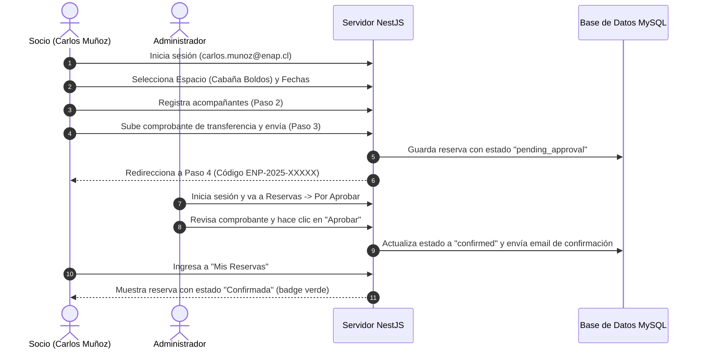
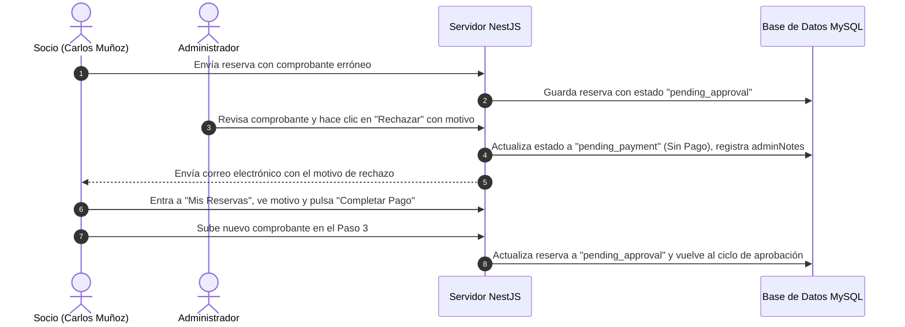
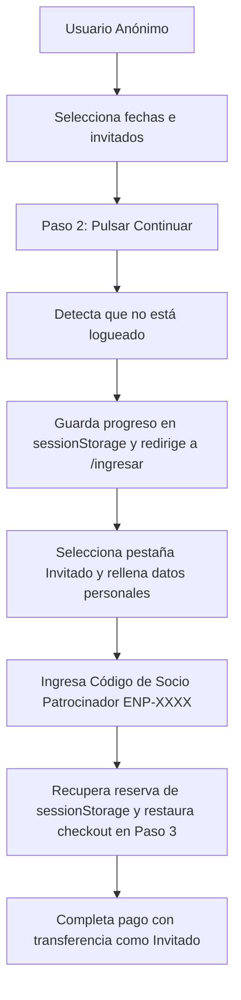
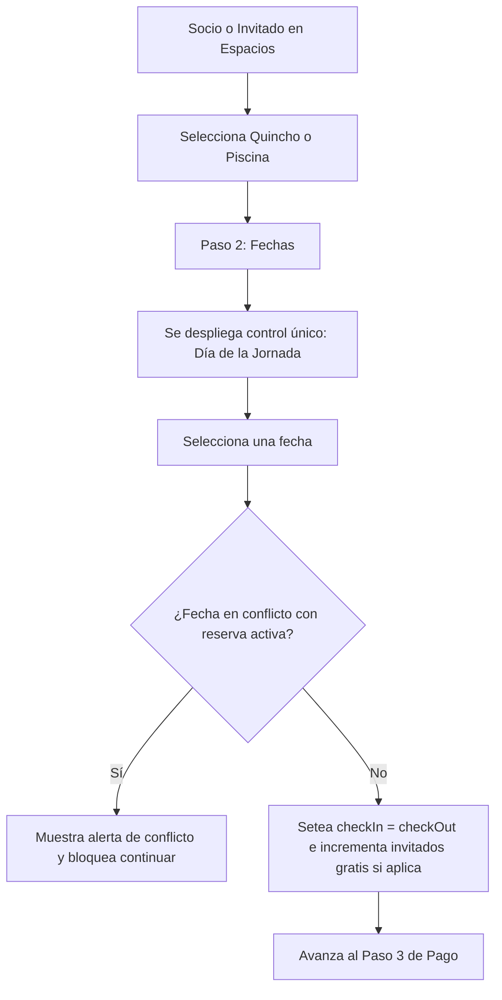
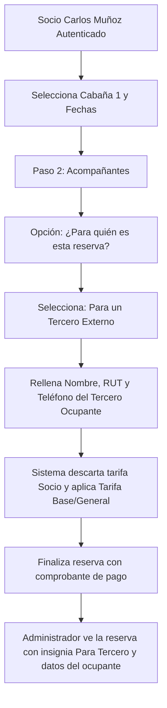

# Manual de Usuario y Guía de Flujos de Pruebas

Esta guía detalla el funcionamiento de la Plataforma de Reservas del Centro Vacacional ENAP (Sindicato ENAP Refinería Bío Bío), los roles de acceso, los flujos de pruebas punta a punta y la configuración de las simulaciones locales para facilitar la certificación del sistema.

---

## 🔑 1. Credenciales de Acceso Rápido
Para simplificar el proceso de pruebas locales, el sistema cuenta con botones de **Quick Login (Acceso Demo)** en la vista de ingreso (`/ingresar`). También puedes ingresar manualmente con las siguientes credenciales (la contraseña es común para todas: `password123`):

*   **Socio Sindical (Cliente):** `carlos.munoz@enap.cl` (Código Ficha: `ENP-0042`)
*   **Administrador:** `admin@sindicatoenap.cl` (Habilita el menú lateral **"Administración"**)
*   **Usuario Externo (Público General):** `ana@gmail.com`

---

## 🏕️ 2. Flujos de Pruebas de Reservas (Usuario)

A continuación se detallan los flujos de pruebas punta a punta con diagramas visuales para un mejor entendimiento de los caminos del usuario.

### Flujo A: Reserva con Transferencia y Aprobación
Este flujo valida el registro de una reserva con pago fuera de línea y la aprobación manual por parte del administrador.

1.  **Iniciar Reserva:** Ingresa con el usuario de Socio (`carlos.munoz@enap.cl`).
2.  **Seleccionar Espacio y Fechas:** Ve a **Espacios**, elige un recinto (ej: *Cabaña Los Boldos*) e introduce fechas válidas (ej. del `19/06` al `25/06`).
3.  **Añadir Acompañantes (Paso 2):** Agrega invitados opcionalmente. Si el recinto es del tipo **Piscina**, los primeros 5 invitados de un Socio son gratuitos. El desglose calculará el total en tiempo real.
4.  **Confirmar con Transferencia (Paso 3):** Selecciona la pestaña **"Transferencia Bancaria"**. Copia los datos bancarios expuestos, adjunta un comprobante físico (PDF, JPG o PNG de prueba) y haz clic en **"Enviar reserva"**.
5.  **Revisión en Mis Reservas:** Serás redirigido al Paso 4 ("Reserva enviada") con un código único (ej: `ENP-2025-00004`). Haz clic en **"Ver mis reservas"** y confirma que aparece listada en estado **"En revisión"**.
6.  **Aprobación (Admin):** Cierra sesión e ingresa como Administrador (`admin@sindicatoenap.cl`). Ve a **Administración** ➔ **Reservas** ➔ pestaña **"Por aprobar"**.
    *   Verás la reserva de Carlos Muñoz.
    *   Puedes hacer clic en el enlace `📄 Comprobante` para abrir el documento adjunto.
    *   Haz clic en **"Aprobar"**.
7.  **Comprobación Final:** Vuelve a loguearte con la cuenta de Carlos Muñoz y verifica en **Mis Reservas** que el estado ha cambiado a **"Confirmada"** (en color verde).

### Flujo B: Reserva con Transferencia y Rechazo Administrativo
Valida el rechazo de una reserva cuando el comprobante no es legible o es erróneo.

1.  **Crear Reserva:** Sigue los pasos 1 a 5 del Flujo A con cualquier usuario.
2.  **Rechazo (Admin):** Entra como Administrador, ve a **Reservas** ➔ **Por aprobar**.
3.  **Acción de Rechazo:** Haz clic en **"Rechazar"**. Se abrirá una ventana solicitando observaciones. Escribe la causa (ej: *"El monto del comprobante no coincide"* o *"Archivo corrupto"*) y acepta.
4.  **Verificación del Cliente:** Logueate nuevamente con la cuenta del usuario. En **Mis Reservas**, la reserva figurará en estado **"Sin pago" (Pago pendiente)**. Aparecerá un banner indicando que fue rechazada junto a las notas de observación del administrador.
5.  **Completar Pago:** El usuario puede pulsar el botón **"Completar pago"**, lo que lo llevará directamente al Paso 3 para adjuntar un nuevo archivo y volver a enviarla a revisión.

### Flujo C: Registro de Nuevo Socio Sindical
1.  **Formulario de Registro:** Ve a `/ingresar` y selecciona la pestaña **"Registrarse"**.
2.  **Completar Datos:** Ingresa Nombre, RUT (válido, ej: `20.123.456-7`), Email, Contraseña y tu **Código de Ficha Sindical** (obligatorio para socios).
3.  **Login Automático:** Al registrarse, el sistema lo iniciará sesión y podrá reservar espacios turísticos con la tarifa exclusiva de Socio.

### Flujo D: Reserva como Invitado (Usuario Anónimo)
Permite a personas realizar reservas sin tener una cuenta registrada previamente en el portal.

1.  **Navegación Anónima:** Sin iniciar sesión, ve a **Espacios**, selecciona fechas y añade acompañantes.
2.  **Redirección de Autenticación:** Al pulsar "Continuar" en el Paso 2, el sistema detecta que no estás autenticado. Guarda el progreso en el `sessionStorage` local y te redirige a `/ingresar`.
3.  **Identificarse como Invitado:** En la pantalla de ingreso, selecciona la pestaña **"Invitado"**.
4.  **Socio Patrocinador:** Rellena tus datos (RUT, Nombre, Correo) e ingresa un **Código de Ficha de Socio de ENAP** que patrocine tu visita (ej. de prueba: `ENP-0078`). Haz clic en **"Continuar como Invitado"**.
5.  **Restauración del Checkout:** La plataforma te autentica de forma temporal con un token de invitado y te devuelve de inmediato al Paso 3 del checkout conservando todos los datos que habías seleccionado. Carga el comprobante y finaliza tu reserva.

### Flujo E: Reserva de Quinchos y Piscina (Jornada Única)
Valida la restricción para que los recintos de uso diario solo puedan ser reservados por jornada simple.

1.  **Iniciar Reserva:** Ve a **Espacios**, selecciona un Quincho (ej. *Quincho Central*) o la *Piscina General*.
2.  **Selector de Fecha de Jornada:** Verás que no hay campos de Check-in y Check-out. En su lugar, se presenta el selector **"Día de la Jornada"**.
3.  **Selección de Fecha:** Selecciona una fecha válida. El sistema setea internamente la misma fecha de entrada y salida (`check_in = check_out`), contando la reserva como 1 día.
4.  **Verificación de Conflictos:**
    *   **Quinchos:** Si intentas seleccionar una fecha que ya está ocupada por otra reserva (ej: `28/12` para Quincho Central), aparecerá una alerta de conflicto en color rojo impidiendo continuar.
    *   **Piscina:** Múltiples socios pueden reservar el mismo día. La alerta de conflicto se mostrará únicamente cuando el aforo acumulado de todas las reservas de ese día alcance los 80 cupos máximos. Si intentas reservar excediendo este aforo, el sistema mostrará los cupos restantes disponibles.
5.  **Completar checkout:** Añade acompañantes y completa el flujo.

### Flujo F: Socio reserva para un Tercero Ocupante (Patrocinio de Beneficio)
Permite a un socio sindical arrendar un espacio para un tercero (familiar o conocido), cobrándose la tarifa base general pero quedando la reserva vinculada y controlada por el socio.

1.  **Autenticación de Socio:** Ingresa con el usuario de Socio (`carlos.munoz@enap.cl`).
2.  **Selección de Espacio (Cabaña):** Ve a **Espacios**, selecciona una cabaña (ej: *Cabaña 1*) e introduce fechas (ej. del `25/06` al `27/06`).
3.  **Declaración de Tercero (Paso 2):** En la sección de acompañantes, verás la casilla **"¿Para quién es esta reserva?"**. Selecciona la opción **"Para un Tercero Externo (Tarifa General)"**.
4.  **Datos del Tercero:** Al seleccionar esta opción, se desplegarán campos para ingresar el Nombre Completo, RUT y Teléfono del ocupante tercero. Complétalos (ej: *Juan Pérez*, *18.123.456-7*).
5.  **Verificación del Precio:** Observa el resumen de precios al final de la pantalla: la tarifa base habrá cambiado automáticamente de la de Socio ($35.000/día) a la Tarifa General ($50.000/día).
6.  **Finalización y Control de Admin:** Completa el pago. Luego, ingresa como Administrador (`admin@sindicatoenap.cl`) y ve a **Administración ➔ Reservas**. Verás la reserva de Carlos Muñoz con la insignia **"Para Tercero"** y la caja con los datos de Juan Pérez en la columna Titular.

---

## 💼 3. Flujos de Gestión en Administración (Admin)
Al ingresar con la cuenta de Administrador, aparecerá el menú **Administración** en el navbar, el cual da acceso a las siguientes áreas CRUD reales:

### Gestión de Espacios (`/admin/espacios`)
*   **Crear Espacio:** Haz clic en **"+ Nuevo espacio"**. Completa el nombre, tipo (Cabaña, Quincho, Piscina), capacidad máxima, tarifas diferenciadas (Base, Socio, Invitado), cantidad de invitados gratis para socios y las comodidades (*Amenities*).
*   **Modificar:** Permite cambiar cualquier valor de un espacio ya registrado.
*   **Eliminar:** Borra el espacio de la base de datos (advertencia: no se puede eliminar si tiene reservas asociadas).

### Gestión de Usuarios (`/admin/usuarios`)
*   **Registrar Usuario:** Permite al administrador crear cuentas directas (Socios, Externos o Administradores). Las cuentas creadas de esta forma se inicializan con una contraseña alfanumérica aleatoria de 6 caracteres generada por el sistema. Esta contraseña se despliega en el toast informativo tras el registro exitoso y se envía simuladamente al correo electrónico del usuario. (Nota: Las cuentas demo precargadas como `carlos.munoz@enap.cl` continúan usando `password123`).
*   **Activar/Desactivar:** Permite suspender temporalmente el acceso de un usuario al sistema haciendo clic en el botón de estado.

### Gestión de Avisos (`/admin/avisos`)
*   **Crear Aviso:** Presiona **"Nuevo Aviso"**. Escribe un título y el contenido. Puedes marcar la casilla **"Destacar aviso"** para fijarlo al principio del muro.
*   **Visualización:** Confirma que el aviso aparece publicado de inmediato en la sección de Noticias de la página de inicio.
*   **Eliminar:** Permite dar de baja anuncios antiguos de forma instantánea.

### Gestión de Galería de Fotos (`/admin/galeria`)
*   **Añadir Imagen:** Permite al administrador cargar fotos reales del centro vacacional ingresando un título, descripción y una URL de imagen (o seleccionando entre los presets predeterminados).
*   **Eliminar:** Permite dar de baja imágenes de la galería pública.

### Gestión de Reservas (`/admin/reservas`)
*   **Filtros y Aprobación:** El administrador puede revisar el listado de todas las reservas y usar filtros de estado (`Por aprobar`, `Aprobadas`, `Rechazadas`).
*   **Identificación de Socios:** Se incluye una columna **"Tipo"** que muestra de forma destacada mediante una insignia de color si el solicitante es **Socio** o **No Socio (Público General/Externo)**.

---

## 💳 4. Flujo de Certificación de Mercado Pago (Sandbox)

### Panel de Pruebas Sandbox (`/admin/mercadopago`)
Esta herramienta permite testear tus credenciales de Mercado Pago configuradas en el archivo `.env` del backend sin alterar registros de reservas reales:
1.  Ingresa al menú lateral **Test Mercado Pago** `💳`.
2.  Digita un concepto (ej: *"Test Cabina"*), cantidad y el monto en pesos (ej: `1000`).
3.  Haz clic en **"Generar Preferencia"**. El backend se comunicará con los servidores de Mercado Pago y retornará el ID del pago de Sandbox.
4.  Pulsa **"Abrir Pasarela de Pago (Sandbox) ↗"**. Se abrirá la pasarela real de pruebas de Mercado Pago.

### Cuentas de Comprador y Tarjetas de Prueba
Utiliza estos datos suministrados por el sistema para completar el pago de prueba en el portal Sandbox:
*   **Email Comprador:** `TESTUSER8015616000490342967`
*   **Contraseña Comprador:** `tBdnrZDT0m`
*   **Tarjeta Visa (Aprobado):** `4168 8188 4444 7115` (Vencimiento: `11/30` | CVV: `123` | Nombre Tarjeta: `APRO`)
*   **Tarjeta Mastercard (Aprobado):** `5416 7526 0258 2580`
*   **Simular Pago Rechazado:** Usa cualquier tarjeta de prueba pero ingresa en Nombre de Tarjeta: `OTHE`

### Verificación del Retorno Automático
Una vez completado el pago de prueba con éxito, Mercado Pago te redirigirá automáticamente de vuelta al panel de administración del frontend y verás un banner verde confirmando: **"¡Pago de Prueba Exitoso! (status=success)"**.

### Rutas de Retorno para Checkout de Reservas (Éxito, Error y Pendiente)
Cuando realizas el pago de una reserva real mediante Mercado Pago en el checkout de la plataforma o en "Mis Reservas", Mercado Pago te redirige automáticamente a una de las siguientes tres vistas del frontend según el resultado de la transacción:
*   **Éxito (`/mercadopago/success`):** Muestra una tarjeta premium de éxito de color verde, extrayendo dinámicamente de la URL los parámetros `payment_id`, `status` y el `external_reference` (código de reserva).
*   **Fallo (`/mercadopago/failure`):** Muestra una tarjeta de advertencia de color rojo con opciones para reintentar la transacción.
*   **Pendiente (`/mercadopago/pending`):** Muestra una tarjeta informativa de color amarillo/ámbar explicando que el pago se encuentra en proceso de validación.

---

## ⚙️ 5. Simulaciones Locales (Bypasses en el Backend)
Para facilitar el desarrollo local sin dependencias externas obligatorias, el backend incluye los siguientes mecanismos automáticos:

1.  **Simulación de Cargas en AWS S3 (Comprobantes y Fotos)**:
    *   Si el backend detecta que las variables de entorno `AWS_ACCESS_KEY_ID` y `AWS_SECRET_ACCESS_KEY` no están definidas o conservan los valores por defecto (`mock_aws_key`/`mock_aws_secret`), el servicio **omite la carga a Amazon S3** y genera una URL de objeto simulada al instante. Esto te permite adjuntar y enviar comprobantes reales en el checkout local sin errores.
2.  **Simulación de Envío de Correos (SMTP)**:
    *   Si las configuraciones de correo en el `.env` (`SMTP_USER`/`SMTP_PASS`) son valores de prueba (`mock_smtp_user`/`mock_smtp_pass`), el backend **omite la conexión al servidor SMTP** de Amazon SES.
    *   En su lugar, imprime un aviso detallado de depuración (`WARN`) en la consola del backend reflejando el remitente, destinatario, asunto y plantilla del correo simulado, evitando timeouts de conexión.

---

## 🖼️ 6. Galería Pública y Visor de Fotos "Conoce el Centro"
El sistema cuenta con una sección interactiva para que los usuarios puedan conocer las instalaciones a través de fotografías reales cargadas por el administrador.

1.  **Navegar a la Galería:** Ve al menú superior y selecciona **"Conoce el Centro"** (o accede a `/conoce-el-centro`). Verás un diseño de cuadrícula moderna con las fotos reales y sus títulos.
2.  **Abrir el Lightbox:** Haz clic sobre cualquiera de las imágenes. Esta se abrirá en un visor de pantalla completa (Lightbox).
3.  **Controles del Lightbox:** Puedes avanzar a la siguiente imagen usando la flecha derecha en pantalla, retroceder con la flecha izquierda, o cerrar la vista con la "X" superior.
4.  **Uso de Teclado:** El visor también responde al teclado:
    *   **Flecha Derecha (`➔`):** Siguiente imagen.
    *   **Flecha Izquierda (`⬅`):** Imagen anterior.
    *   **Tecla `ESC`:** Cerrar el Lightbox.
