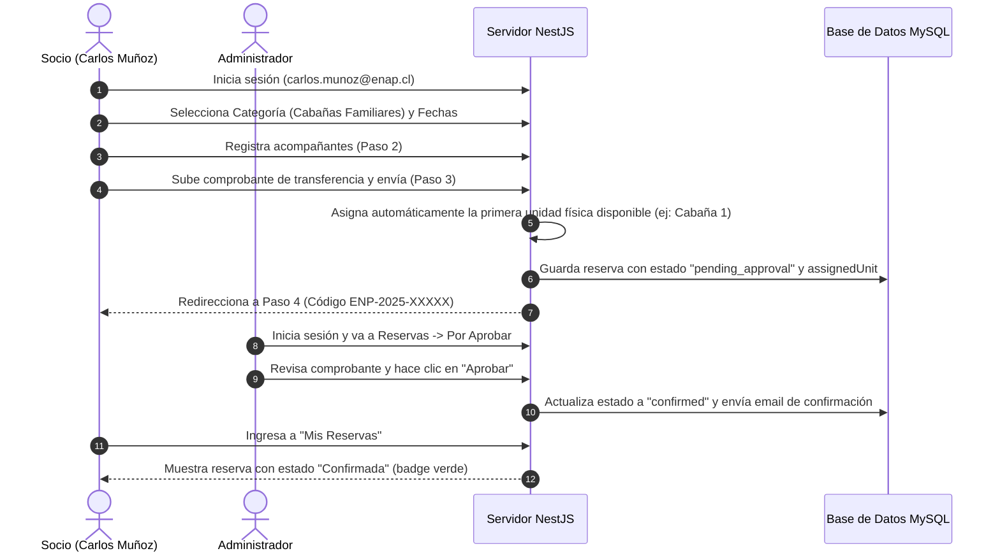

# Manual de Usuario y Guía de Flujos de Pruebas

Esta guía detalla el funcionamiento de la Plataforma de Reservas del Centro Vacacional ENAP (Sindicato ENAP Refinería Bío Bío), los roles de acceso, los flujos de pruebas punta a punta y la configuración de las simulaciones locales para facilitar la certificación del sistema en entornos de desarrollo y producción.

---

## 🔑 1. Credenciales de Acceso Rápido
Para simplificar el proceso de pruebas locales, el sistema cuenta con botones de **Quick Login (Acceso Demo)** en la vista de ingreso (`/ingresar`). También puedes ingresar manualmente con las siguientes credenciales (la contraseña es común para todas: `password123`):

*   **Socio Sindical (Cliente):** `carlos.munoz@enap.cl` (Código Ficha: `ENP-0042`)
*   **Administrador:** `admin@sindicatoenap.cl` (Habilita el menú lateral **"Administración"**)
*   **Usuario Externo (Público General):** `ana@gmail.com`

---

## 🏕️ 2. Flujos de Pruebas de Reservas y Funcionalidades (Usuario)

### Flujo A: Reserva con Transferencia y Aprobación
Este flujo valida el registro de una reserva con pago fuera de línea y la aprobación manual por parte del administrador.

1.  **Iniciar Reserva:** Ingresa con el usuario de Socio (`carlos.munoz@enap.cl`).
2.  **Seleccionar Espacio y Fechas:** Ve a **Espacios**, elige un recinto (ej: *Cabaña Los Boldos*) e introduce fechas válidas.
3.  **Añadir Acompañantes y Declarar Visita (Paso 2):** Declara el tipo de visita en el selector ("Uso Personal", "Carga Familiar" o "Familiares o Amigos"). Añade invitados ingresando Nombre, RUT y **Edad** en la tabla dinámica.
4.  **Aceptar Reglamento y Confirmar Pago (Paso 3):** Marca la casilla de aceptación obligatoria del reglamento. Haz clic en "términos de arriendo" para comprobar que se despliega el modal flotante con las normas de convivencia del centro. Selecciona **"Transferencia Bancaria"**, copia los datos, adjunta tu comprobante y haz clic en **"Enviar reserva"**.
5.  **Revisión de Notificación (Paso 4):** Valida que se muestra la confirmación de solicitud enviada con un aviso advirtiendo explícitamente que la administración validará el pago en un plazo máximo de 48 horas. Haz clic en **"Ver mis reservas"** para constatar que figura en estado **"En revisión"**.
6.  **Aprobación (Admin):** Cierra sesión e ingresa como Administrador (`admin@sindicatoenap.cl`). Ve a **Administración ➔ Reservas ➔ Por aprobar**.
    *   Puedes hacer clic en el enlace `📄 Comprobante` para verificar el documento adjunto.
    *   Haz clic en **"Aprobar"**.
7.  **Comprobación Final:** Vuelve a loguearte con la cuenta de Carlos Muñoz y verifica en **Mis Reservas** que el estado ha cambiado a **"Confirmada"** (en color verde).

---

### Flujo B: Gestión de Perfil de Usuario y Seguridad
Valida la edición de datos personales del usuario y la actualización de contraseñas de forma segura en producción.
1.  **Ingresar a Perfil:** Inicia sesión con cualquier cuenta y haz clic en el menú **Mi Perfil** en la Navbar.
2.  **Modificar Datos de Contacto:**
    *   Intenta cambiar tu correo o teléfono.
    *   Ingresa un teléfono erróneo (ej: `12345`). Verás una alerta de error de formato. El sistema exige formato telefónico chileno: `^(\+56)?9\d{8}$` (ej: `912345678` o `+56912345678`).
    *   Modifica el teléfono a un formato válido y presiona **"Guardar cambios"**. El toast confirmará la actualización.
3.  **Confirmar en Checkout (Paso 2):** Inicia una reserva y avanza al Paso 2 (Invitados). Verifica que se despliega una tarjeta con tus datos oficiales (Nombre, RUT, Ficha code). Cambia tu correo o teléfono desde esta tarjeta, haz clic en continuar y verifica en tu página de perfil (`/perfil`) que los cambios se guardaron automáticamente.
4.  **Actualizar Contraseña:**
    *   En la sección de seguridad, digita tu contraseña actual (`password123`), escribe tu nueva contraseña (ej. `nuevaClave12`) y confírmala.
    *   Presiona **"Actualizar Contraseña"**.
    *   Haz logout de la plataforma e inicia sesión nuevamente usando tu nueva contraseña para confirmar que quedó almacenada mediante hashing seguro PBKDF2 en el backend.

---

### Flujo C: Sistema de Opiniones y Moderación
Valida la subida de retroalimentación de los socios y la posterior aprobación del administrador.
1.  **Dejar Opinión (Socio):**
    *   Ingresa con tu cuenta de Socio. Ve a **Mis Reservas**.
    *   Para una estadía finalizada (cuyo check-out sea anterior o igual al día de hoy) y que no tenga opinión registrada, verás el botón **"⭐ Dejar Opinión"**.
    *   Haz clic en él. Selecciona una calificación (1 a 5 estrellas) y escribe un comentario de tu experiencia. Presiona **"Enviar Opinión"**.
    *   El comentario quedará listado en tu reserva en estado *"Pendiente de moderación"*.
2.  **Moderación (Administrador):**
    *   Inicia sesión como Administrador (`admin@sindicatoenap.cl`).
    *   Ve a **Administración ➔ Opiniones**.
    *   Verás la opinión creada en estado *Pendiente*. Puedes pulsar **"Aprobar"** o **"Rechazar"**.
    *   Haz clic en **"Aprobar"**.
3.  **Comprobación Pública:**
    *   Navega a la sección **Espacios**. Verás que el espacio evaluado actualizó su calificación promedio de estrellas y cantidad de votos.
    *   Entra al espacio y en el Paso 1 de la reserva, comprueba que la opinión aprobada ahora aparece listada en la sección de opiniones de los socios.

---

### Flujo D: Pronóstico del Clima Local y Alertas Preventivas
Valida cómo influye el clima en la experiencia del usuario de manera inteligente.
1.  **Logotipo y Clima en Portada:** En el Hero del Home, revisa que el logotipo oficial del Centro Vacacional aparece prominentemente destacado a la izquierda de los textos en una tarjeta blanca con sombras. Al lado de "Limache, Chile", verifica el badge translúcido que muestra el clima en vivo.
2.  **Clima en Catálogo:** En `/espacios`, verifica el pill climatológico al lado del título "Espacios disponibles" que sirve para orientar al usuario antes de reservar.
3.  **Previsión en Reserva (Paso 1):** Inicia el checkout de un Quincho o Cabaña. Al lado del selector de fechas verás una previsión compacta para los siguientes 3 días (máxima y mínima).
4.  **Alerta Preventiva de Lluvia:**
    *   En el backend, el pronóstico diario es consumido de Open-Meteo. (Si la API falla, utiliza fallback de pruebas locales).
    *   Selecciona un Quincho o Piscina (espacios exteriores).
    *   Elige una fecha del calendario donde el pronóstico prevea precipitaciones (lluvia, chubascos, tormentas, llovizna).
    *   Al seleccionar la fecha, aparecerá automáticamente un banner ámbar: *"Alerta: Este es un espacio al aire libre y hay pronóstico de precipitaciones. Podrías preferir reprogramar"*.

---

### Flujo E: Guía de Estadía & FAQ Interactivo
Valida la consulta de soporte dinámico.
1.  **Sección de Ayuda:** En la página de Inicio, ve a la sección **"Guía de Estadía & FAQ Interactivo"**.
2.  **Visualizar Normas y FAQs:** Revisa la columna izquierda con normas críticas (uso de sábanas en cabañas, carbón en quinchos) y la columna derecha con el acordeón de Preguntas Frecuentes.
3.  **Interactuar con Preguntas:** Haz clic en una FAQ para expandir su contenido suavemente. Las FAQs que se listan son cargadas desde la base de datos (con las preguntas semilla de ENAP-turismo y sindicato).
4.  **Modificar FAQs (Admin):** Entra como Admin, ve a **Administración ➔ Preguntas Frecuentes** (`/admin/faqs`). Modifica, elimina o añade una pregunta nueva. Valida que se actualiza al instante en la Home.

---

### Flujo F: Reserva como Invitado (Usuario Anónimo)
1.  **Navegación Anónima:** Sin iniciar sesión, ve a **Espacios**, selecciona fechas y añade acompañantes.
2.  **Redirección de Autenticación:** Al pulsar "Continuar" en el Paso 2, el sistema detecta que no estás autenticado, guarda el progreso en `sessionStorage` y te redirige a `/ingresar`.
3.  **Identificarse como Invitado:** En la pantalla de ingreso, selecciona la pestaña **"Invitado"**. Rellena tus datos (RUT, Nombre, Correo) e ingresa opcionalmente un Código de Ficha de Socio Patrocinador. Haz clic en **"Continuar como Invitado"**.
4.  **Restauración del Checkout:** La plataforma te autentica de forma temporal y te devuelve de inmediato al Paso 3 del checkout conservando todos los datos que habías seleccionado. Carga el comprobante y finaliza tu reserva.

---

### Flujo G: Reserva de Quinchos y Piscina (Jornada Única)
1.  **Iniciar Reserva:** Ve a **Espacios**, selecciona *Quinchos Familiares* o la *Piscina General*.
2.  **Selector de Fecha de Jornada:** Verás el selector **"Día de la Jornada"** (check_in = check_out).
3.  **Verificación de Conflictos:**
    *   **Quinchos Familiares:** Si intentas seleccionar una fecha ocupada (donde las 10 unidades físicas de Quinchos ya están reservadas), el sistema deshabilitará esa fecha y aparecerá una alerta de conflicto en color rojo.
    *   **Piscina:** Múltiples socios pueden reservar el mismo día. La alerta de conflicto se mostrará únicamente cuando el aforo acumulado de todas las reservas de ese día alcance los 1.000 cupos máximos.

---

### Flujo H: Socio reserva para un Tercero Ocupante (Patrocinio de Beneficio)
1.  **Autenticación de Socio:** Ingresa con el usuario de Socio.
2.  **Selección de Cabaña:** Elige fechas. En el selector de tipo de visita (Paso 2), selecciona la opción **"Familiares o Amigos (Tarifa General)"**.
3.  **Datos del Tercero:** Ingresa Nombre Completo, RUT y Teléfono del ocupante tercero.
4.  **Verificación del Precio:** Observa que la tarifa base habrá cambiado automáticamente a la Tarifa General ($50.000/día).
5.  **Aprobación Admin:** Completa el pago. El Administrador verá la reserva marcada con la insignia **"Para Tercero"** y la caja con los datos del tercero en la columna Titular.

---

### Flujo I: Cierre de Lunes y Expiración de 48 Horas (Reglas Hito 2)
Este flujo valida que las reglas automáticas de Hito 2 funcionen correctamente.
1.  **Verificación de Cierre de Lunes:**
    *   Navega por la Home o el catálogo de `/espacios`.
    *   Ingresa a reservar cualquier cabaña, quincho o piscina.
    *   Intenta seleccionar un día lunes del calendario (ej: cualquier lunes del mes). Verás que la fecha aparece bloqueada y no permite continuar.
    *   Si intentas forzar el registro de reserva conteniendo un día lunes, el backend rechazará la transacción indicando que el recinto se encuentra cerrado por mantención general.
2.  **Verificación de Expiración Automática:**
    *   Genera una reserva con opción de transferencia bancaria y finalízala (sin subir comprobante, quedará en estado `pending_payment`).
    *   Simula en la base de datos (o espera 48 horas) cambiando la fecha de creación de dicha reserva para que tenga una antigüedad mayor a 48 horas.
    *   Recarga la pestaña de **Mis Reservas** o consulta la disponibilidad de cualquier espacio.
    *   El backend detectará la inactividad de pago y actualizará automáticamente el estado de la reserva a **Expirada** (`expired`), liberando los días bloqueados de forma inmediata.

---

### Flujo J: Menú de Navegación Móvil (Hamburguesa)
Valida que la barra de navegación se adapte y funcione correctamente en smartphones.
1.  **Simular Pantalla Móvil:** Activa la simulación de vista de dispositivo móvil en las herramientas de desarrollador del navegador (tecla `F12` y haz clic en el icono de celular/tablet) o ingresa directamente desde un teléfono.
2.  **Verificar Ocultación:** Constata que el menú superior horizontal de navegación tradicional desaparece por completo y es sustituido por el botón de hamburguesa (`☰`) en la esquina derecha de la Navbar.
3.  **Desplegar Menú:** Haz clic en el botón de hamburguesa `☰`. Se debe deslizar un cajón vertical de color verde que lista todos los accesos principales de la plataforma (Inicio, Espacios, etc.) y botones de ingreso/cierre de sesión.
4.  **Navegación e Interacción:** Haz clic en el icono `✕` para cerrar el cajón, o pulsa sobre cualquier enlace (ej: *Espacios*) para comprobar que te redirige a la ruta correcta y que el cajón se cierra automáticamente tras la pulsación.

---

### Flujo K: Reasignación y Gestión de Unidades Físicas (Administración)
Este flujo valida cómo el administrador gestiona e inspecciona el inventario de recintos físicos asignados.
1.  **Ingresar a Reservas**: Carga la administración con perfil de Administrador y ve a la pestaña **Reservas**.
2.  **Ver Asignación Actual**: En la grilla de reservas, la columna **Espacio** mostrará la categoría ("Cabañas Familiares" o "Quinchos Familiares") junto con un dropdown pre-seleccionado con la unidad física asignada automáticamente (ej: `"Cabaña 1"`).
3.  **Cambio de Unidad**: Abre el selector de la unidad y cámbialo a otra unidad (ej: `"Cabaña 3"`). Presiona aceptar.
    *   El frontend invoca la API `PATCH /bookings/:id/assign-space` pasando el ID de categoría y el nombre de la unidad `"Cabaña 3"`.
    *   Si la unidad se encuentra desocupada en esas fechas, se actualiza exitosamente en la grilla y el backend.
    *   Si la unidad ya se encuentra reservada por otro usuario para ese rango, el backend arrojará una excepción `400 BadRequest` ("La unidad Cabaña 3 ya se encuentra ocupada...") y la plataforma mostrará la alerta correspondiente, manteniendo intacta la asignación previa.
4.  **Inspección Visual en el Calendario**: Ve a la pestaña **Calendario** en la barra superior.
    *   Elige ver todas las categorías de espacios.
    *   Verás que las celdas del mes muestran específicamente el nombre de la unidad física reservada (ej: `"Cabaña 3"` o `"Quincho 5"`) en las celdas diarias del calendario, facilitando el control logístico de los recintos.

---

## 💼 3. Flujos de Gestión en Administración (Admin)

Al ingresar con la cuenta de Administrador, aparecerá el menú **Administración** en el navbar, dando acceso a las siguientes áreas CRUD reales:

### Gestión de Espacios (`/admin/espacios`)
*   **Subida Múltiple a S3:** Al crear o editar un espacio, puedes subir múltiples fotos desde tu equipo local. Las imágenes se envían a AWS S3 y se listan como miniaturas en el formulario. Puedes eliminar las fotos de forma individual.
*   **CRUD completo:** Permite crear, modificar y eliminar espacios.

### Gestión de Usuarios (`/admin/usuarios`)
*   **Registrar Usuario:** Permite crear cuentas directas de socios, externos u administradores. Al registrar un socio, el Código de Ficha es opcional; si se omite, el sistema generará y asignará automáticamente una ficha única en formato `ENP-XXXX` (4 dígitos aleatorios). Las cuentas creadas se inicializan con una clave de 6 caracteres expuesta en pantalla y enviada por correo.
*   **Activar/Desactivar:** Permite suspender temporalmente el acceso de un usuario.

### Gestión de Avisos (`/admin/avisos`)
*   **Subida de Foto a S3:** Reemplazado el input de URL por un cargador de archivos directo a S3.
*   **Crear/Eliminar:** Permite publicar noticias destacadas y dar de baja anuncios antiguos.

### Gestión de Galería de Fotos (`/admin/galeria`)
*   **Cargador S3:** Permite subir imágenes de forma directa a S3 ingresando título y descripción.
*   **Eliminar:** Permite dar de baja fotos del carrusel público.

---

## 💳 4. Flujo de Certificación de Mercado Pago (Sandbox)

### Panel de Pruebas Sandbox (`/admin/mercadopago`)
1.  Ingresa al menú lateral **Test Mercado Pago** `💳`.
2.  Digita concepto, cantidad y monto, y haz clic en **"Generar Preferencia"**.
3.  Pulsa **"Abrir Pasarela de Pago (Sandbox) ↗"**. Se abrirá la pasarela real de pruebas de Mercado Pago.
4.  Utiliza las siguientes credenciales para pagar:
    *   **Email Comprador:** `TESTUSER8015616000490342967`
    *   **Contraseña Comprador:** `tBdnrZDT0m`
    *   **Tarjeta Visa (Aprobado):** `4168 8188 4444 7115` (Vencimiento: `11/30` | CVV: `123`)
5.  Una vez completado el pago, serás redirigido de vuelta al panel mostrando el banner verde **"¡Pago de Prueba Exitoso!"**.

### Rutas de Retorno para Checkout de Reservas (Éxito, Error y Pendiente)
Cuando pagas una reserva con Mercado Pago, serás redirigido a:
*   **Éxito (`/mercadopago/success`):** Muestra una tarjeta premium de éxito verde con el ID de pago, código de reserva y confirmación automática.
*   **Fallo (`/mercadopago/failure`):** Muestra una tarjeta roja para reintentar la transacción.
*   **Pendiente (`/mercadopago/pending`):** Muestra una tarjeta amarilla con información de acreditación pendiente.

---

## ⚙️ 5. Simulaciones Locales (Bypasses en el Backend)

Para facilitar el desarrollo local sin dependencias externas obligatorias, el backend incluye los siguientes mecanismos automáticos:

1.  **Simulación de AWS S3**: Si no se configuran las credenciales en el `.env`, el backend omite la carga real y genera una URL simulada válida.
2.  **Simulación de AWS SES (SMTP)**: Si las configuraciones de correo son de prueba, el backend omite la conexión y escribe en la consola de NestJS los detalles del correo que se habría enviado.
